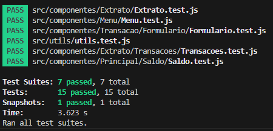

## Welcome again to another React project! 👋

# React Project - Using Jest and Testing Library

## Test the project yourself: [Teste the project here!!!](#)

### Tests

- Tests result.



## Some code that I'm proud of

```js
describe('Componente <Saldo />', () => {
  test('Deve renderizar o saldo com valor monetário', () => {
    render(<Saldo saldo={1000} />);
    const saldo = screen.getByTestId('saldo');
    expect(saldo).toHaveTextContent('R$ 1000');
  });
});
```

## Built with

- REACT;
- Jest;
- Prettier;
- Eslint.

## Author

- Website - [My GitHub](https://github.com/lucasbailo)
- Frontend Mentor - [@lucasbailo](https://www.frontendmentor.io/profile/lucasbailo)
- Instagram - [@lucassbailo](https://www.instagram.com/lucassbailo/)
- LinkedIn - [Lucas Bailo](https://www.linkedin.com/in/lcsbailo)
